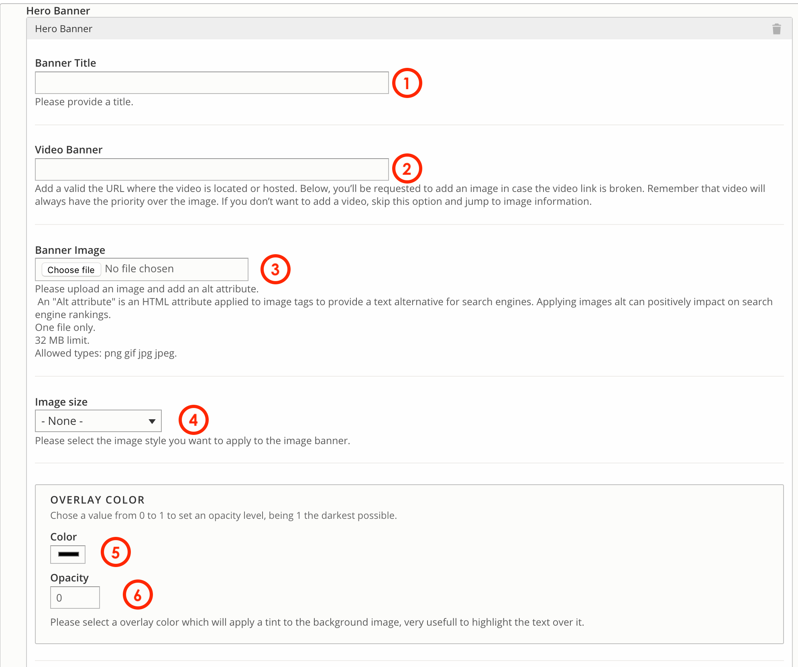

# Events / Webinars

**Event / Webinars** content type allows editors to create upcoming Events or Webinars that can be displayed by using [Dynamic block ](../paragraphs/dynamic-block.md)paragraphs or views. 

As an editor, you'll be requested to set the date, time and venue, plus an event title and a description, as shown below.

You can call out **Events and Webinars** information from a page by using **Dynamic block,** which is already configured to display 1 upcoming Webinar \(in green color\) and 1 upcoming Event \(in blue color\). E.g.:

## How to create an Events/Webinar content type

To create a Generic detail select **Content** =&gt; **Add Content** =&gt; **Events & Webinars**

You should see a form composed by 3 tabs: _Hero zone, Basic Information_ and _Components._ 

### First tab: Hero Zone

It gives you the option to add a Hero banner to an event. 


If you don't want to add a Hero banner, skip this step and go directly to the second tab. 


1. **Banner title:** add a title if desired. This title will not be visible for users.
2. **Video Banner:** add the url where is video is hosted. If you want to use an image instead, skip this step. 
3. **Banner Image:** choose the image to upload from your PC.
4. **Image size:** this option allow editors to select the image size displayed on the viewport.


Remember that the video will always have the priority over the image. 

Image file requirements: One file only. 32 MB limit. Allowed types: png gif jpg jpeg


