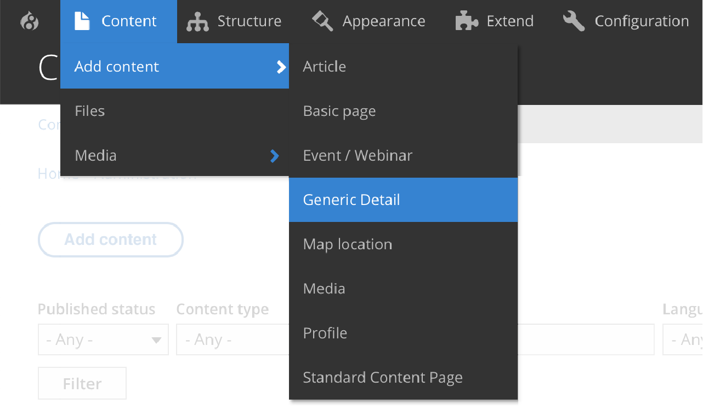
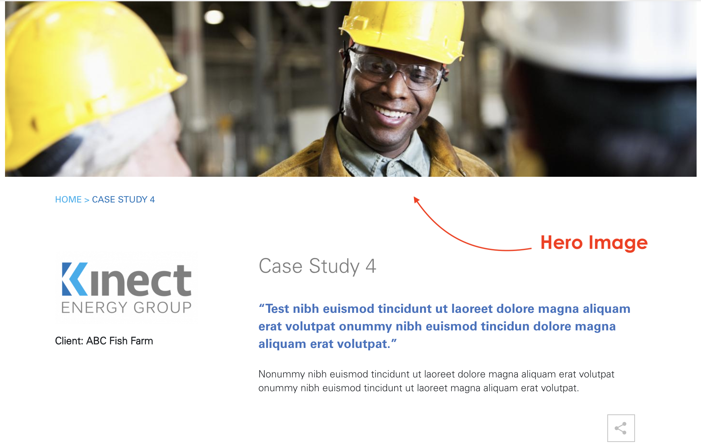
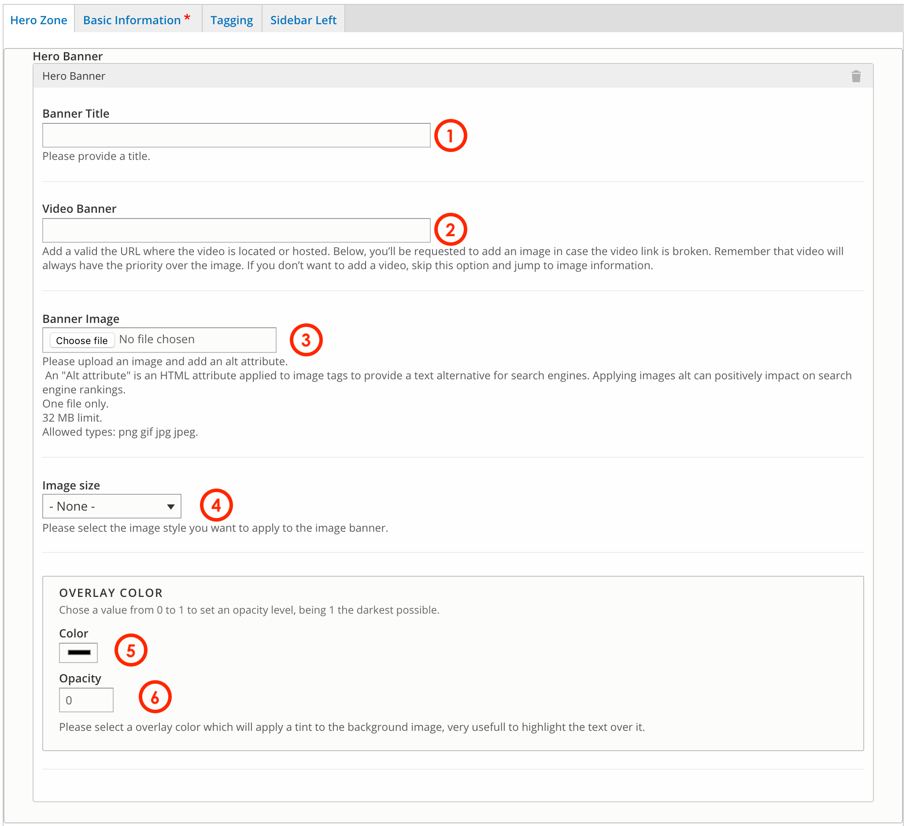
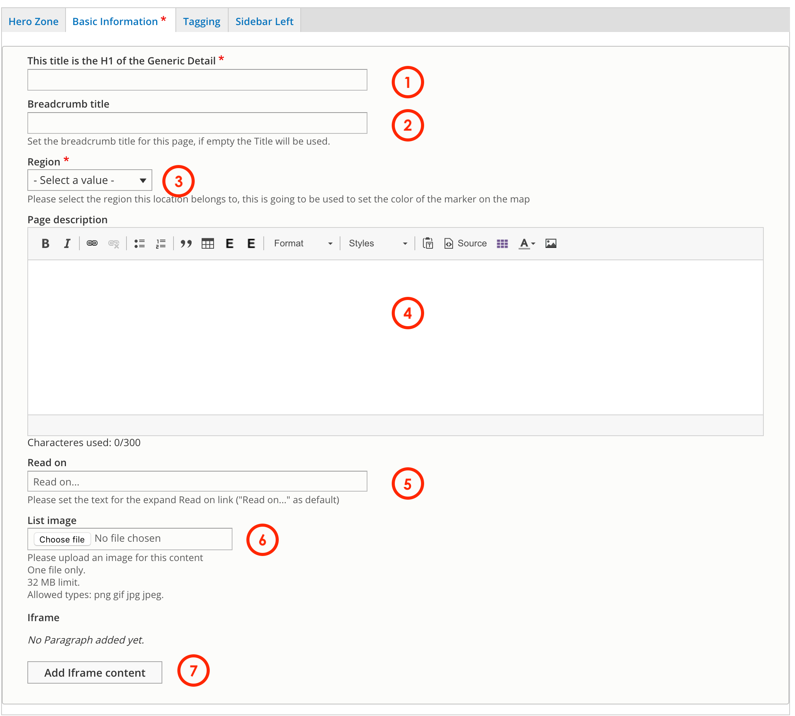
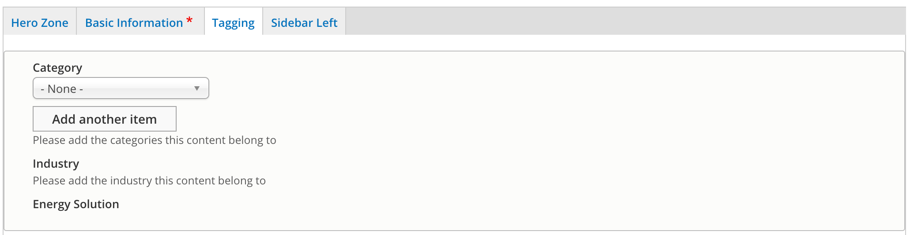
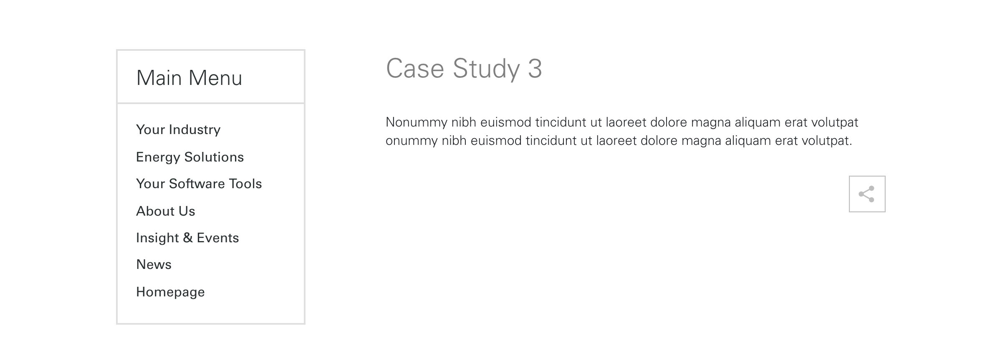
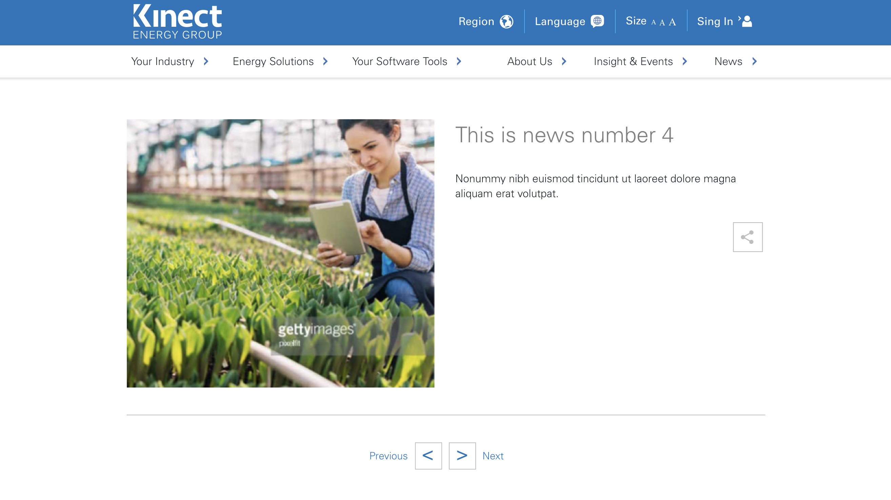
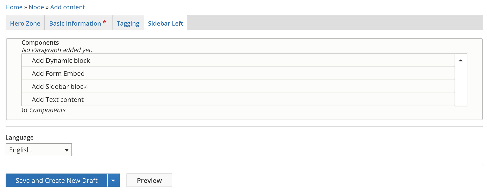

# Generic Details

**Generic detail** allows editors to create pieces of content using a predefined template. **Generic details** comes with a specific layout according to the content you want to display. You can use this content type to create: _News, Case Studies and Success Stories_.

## News {#news}

This template features two columns \(50-50\) . You can add an image to the left and a title plus description to the right.

## Case Studies {#case-studies}

This template is preset as 30-70. The left column is a WYSIWYG that can hold an image, logo, icon and text. The right column features a title, a quotation and a description.

## Success Stories {#success-stories}

This template features two columns \(50-50\) . You can add an image to the left and a title plus description to the right.

## How to create a Generic Detail content type

To create a Generic detail select **Content** =&gt; **Add Content** =&gt; **Generic Details**

The form for creating a **Generic detail** has 4 tabs:

### First tab: Hero banner

The first tab is Hero Banner. It gives you the option to add a Hero banner when generic detail's page is displayed on the viewport. See the example below:


If you don't want to add a Hero banner, skip this step and go directly to the second tab. 


To add the hero banner, you must fill up the Hero banner tabs like this:

1. **Banner title:** add a title if desired. This title will not be visible for users.
2. **Video Banner:** add the url where is video is hosted. If you want to use an image instead, skip this step. 
3. **Banner Image:** choose the image to upload from your PC.
4. **Image size:** this option allow editors to select the image size displayed on the viewport.

   5. Overlay color: this feature allows you to add a color block that will be place over the image as a background for the text.   
   6 Opacity: set the


Remember that the video will always have the priority over the image. 

Image file requirements: One file only. 32 MB limit. Allowed types: png gif jpg jpeg


### Second tab: Basic Information

This is information will give us the H1 for the SEO, descriptions and finally the elements we need to create the component itself.

1. **Title**: this is the H1 and it's very important for SEO purposes and the title that will be displayed.
2. **Breadcrumb** **title**: you can define your own breadcrumb. If you leave this field empty, title will taken as the breadcrumb. 
3. **Region:** set the region from the dropdown menu. This content will be displayed only on the region that you have selected.
4. **Description**: gives you the option to include a text description that will come below the title
5. **Read** **on**: this is the clickable text that will take users toward that generic detail's page. "Read on" is the text by default but it can be customizable.
6. **List** **image**: this is the image that will be used when the generic detail is displayed in a view. For exemple. For more information, refer to Views category in the menu on the left menu. 

### Third tab: Tagging 

You'll be requested to select the tag for the generic content you're creating. This is define de correct layout depending on your choice and also will help the system to call out these content for the views. 

All you have to do is to select one category from the dropdown menu. The most commonly used tags are: **News, Case studies and Success Stories.** 

### **Fourth tab: Sidebar left**

This options allows you to add a Sidebar paragraph to the left capable to display a view of content view, such as: upcoming events, a subscription form or a menu.

#### This is an example of a Generic details with a sidebar:

#### This is a generic details without a sidebar:

All you have to do is to select one component from the dropdown menu. 


Again, if you don't need a sidebar, you should leave this tab form empty. 


Once you have completed the tabs, just hit **Save** and select from _"Save and Create New Draft",_ "_Save and Request Review"_ or _"Save and Publish"._


Congratulations, now you can create a **Generic Detail**


