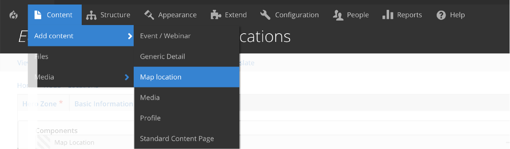
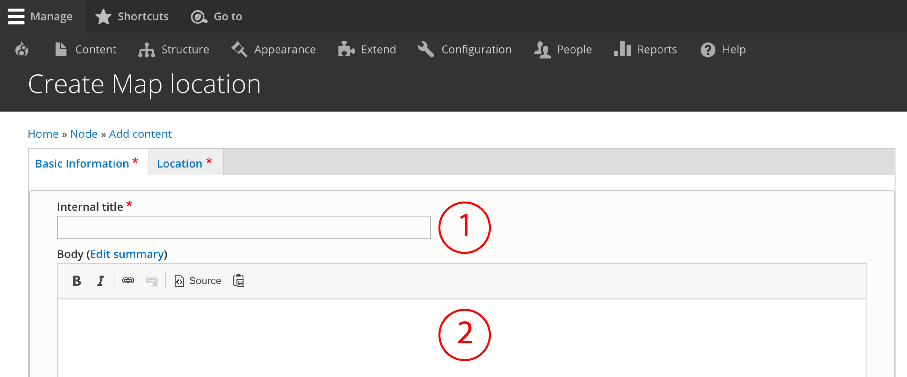
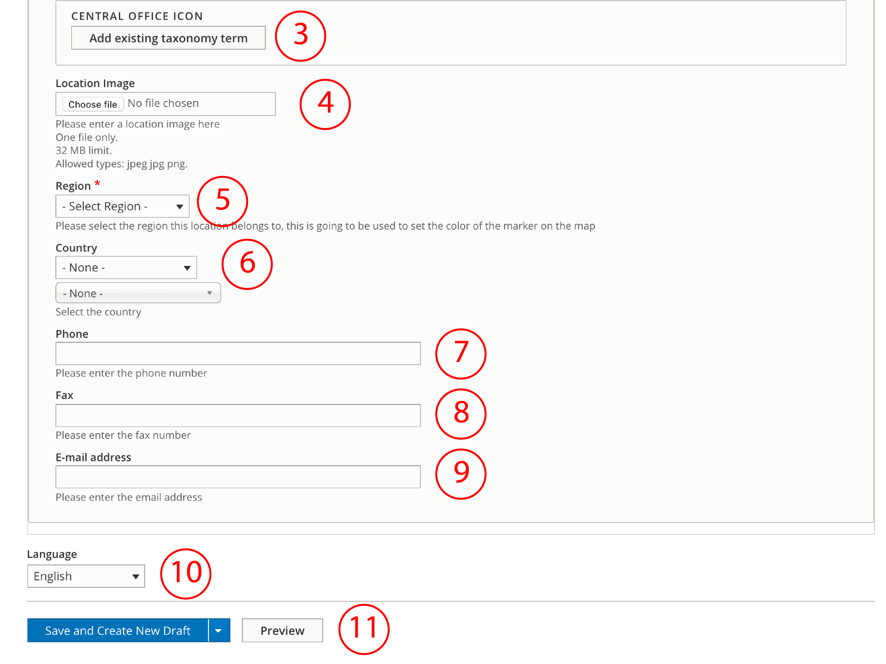
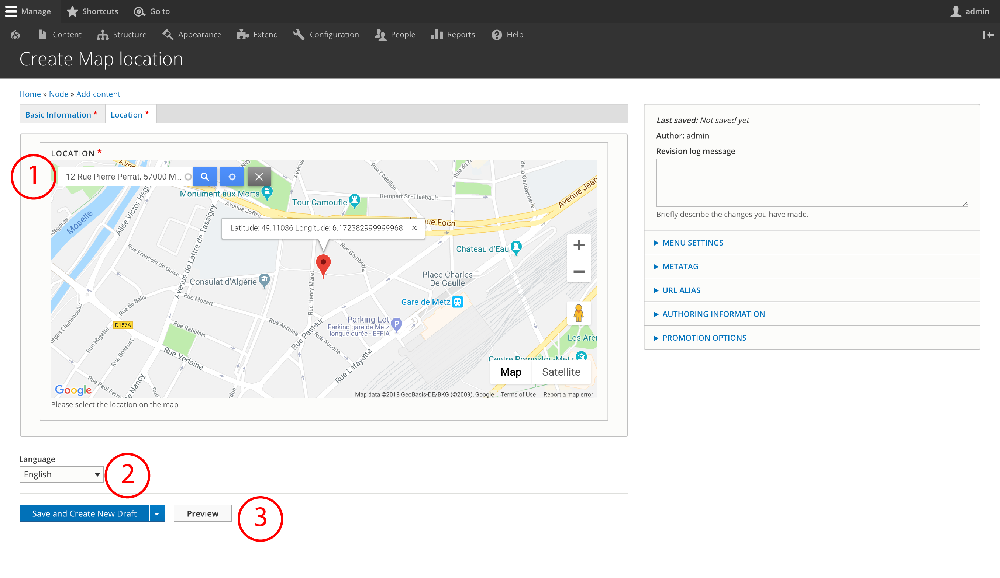

# Map Location content type

**Map Location c**ontent type allows editors to create a sort of _virtual business card_ for each location. It features key contact information like telephone or email, but also the exact address that will be displayed on the map. 

This is the information that will be displayed by using the ****[**Map Location paragraph**](../paragraphs/map-location.md), so before using the Map Location paragraph, be sure you have already created the Map Location content type that we're about to describe. 

## How to create a Map Location

To create a Generic detail select **Content** =&gt; **Add Content** =&gt; **Map Location**

Map location's form is composed by two tabs:

* **Basic Information:** all data regarding the contact information, region, country, language, etc.
* **Location:** this is the tab where you'll be able to add a address for map display purposes. 

### First tab: Basic Information

   1. **Internal Title:** this should be name of the location. E.g : Terry Hills Main Office  
   2. **Body:** add the address you want to be displayed on the contact information. 

   3. **Central Office Icon:** in case you need to include a specific icon. In this case, choose add and you'll be requested yo choose one from the taxonomy terms that have already been created. If there isn't one, you can create your own, simply go to the menu and press **Structure** ===&gt; **Taxonomy** ===&gt; **Central Icon Office.**   
   4. **Location Image:** select the image you want to be displayed. You can select the image from files on your computer. Usually is a photo from the office and its surroundings.   
   5. **Region:** set the region from the dropdown menu. This selection is needed for narrowing the search with the filter "Region"  
   6. **Country**: same as region, is needed for the filter options.  
   7. **Phone**  
   8. **Fax**  
   9. **Email** **Address**  
 10. **Language**: select the language. This is important in order to properly display the content according to the region that users have selected while they browse the website.  
  11.**Save:** you can select _"Save and Create New Draft",_ "_Save and Request Review"_ or _"Save and Publish"._  

### Second tab: Location

1. **Location**: type the full address. Check that the map is displaying the right location. 
2. **Language**: select the language. This is important in order to properly display the content according to the region that users have selected while they browse the website.
3. **Save:** you can select _"Save and Create New Draft",_ "_Save and Request Review"_ or _"Save and Publish"._

\_\_

_**Congratulations...you know how to use and create the Map Location Content type!**_

