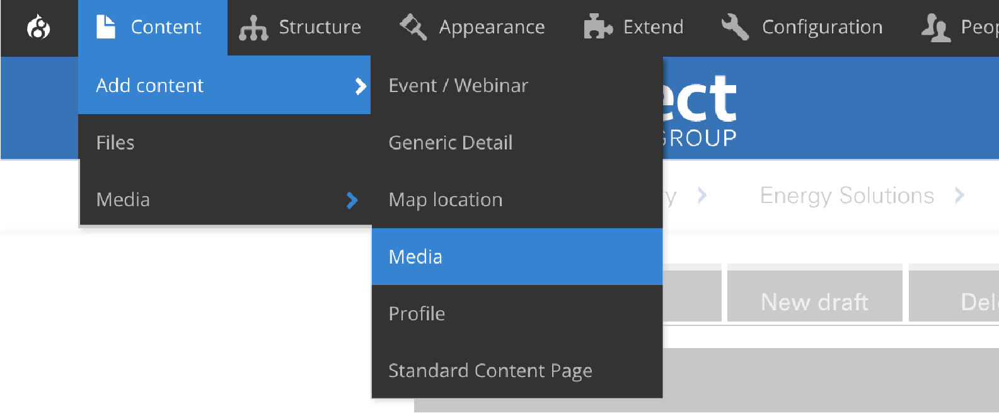
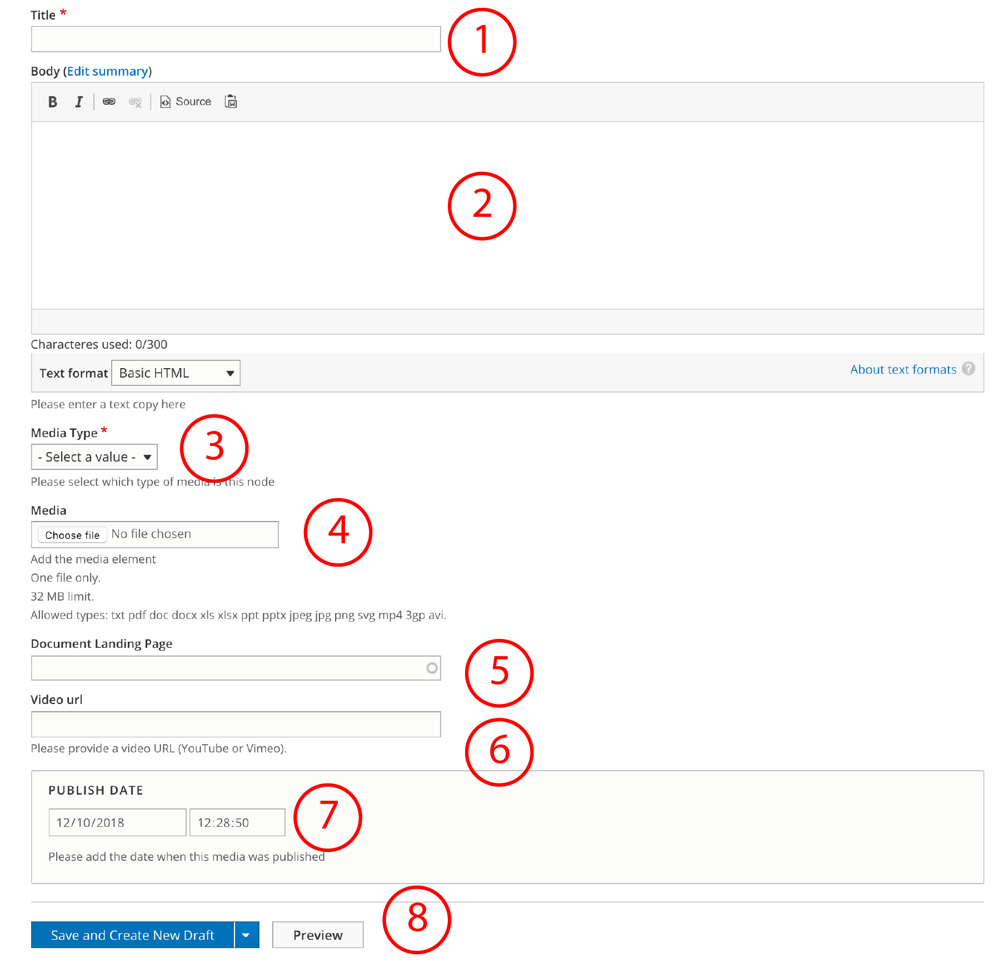

# Media content type

This content type allows Editors to upload different formats of media files that will be required by paragraphs. 

Formats supported:

* **Document**
* **Image**
* **Video**
* **Report**

Some considerations: _32 MB max limit_. Allowed types are: _txt pdf doc docx xls xlsx ppt pptx jpeg jpg png svg mp4 3gp avi._

## How to create Media content type

To create a Generic detail select **Content** =&gt; **Add Content** =&gt; **Media**

You'll see a form like this:

1. **Title**: add a title for this node.
2. **Body**: add a description if needed
3. **Media** **Type**: select the media type from the dropdown menu. If you select video, an URL will be required \(see number 6\)
4. **Media**: choose the file you want to upload from your PC
5. **Document** landing page: select the page where you want the document to be hosted. 
6. **Video** **URL**: add the url where is video is hosted. Can be video or youtube url. 
7. **Publish** **date**: set the date and time the media was published. 

Congratulations! Now you can publish media content type.

