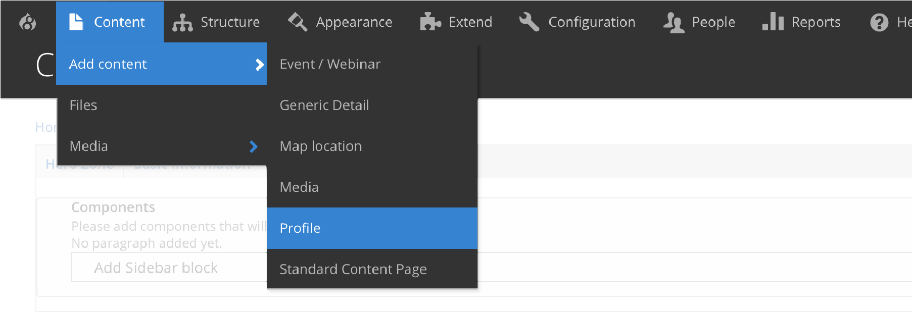
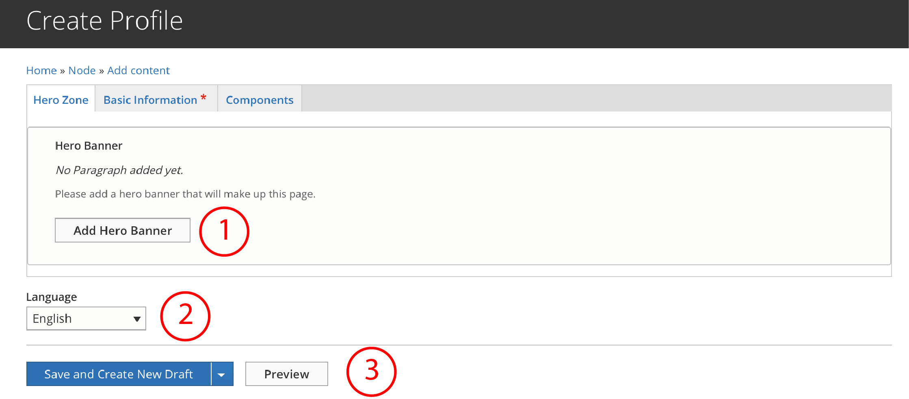
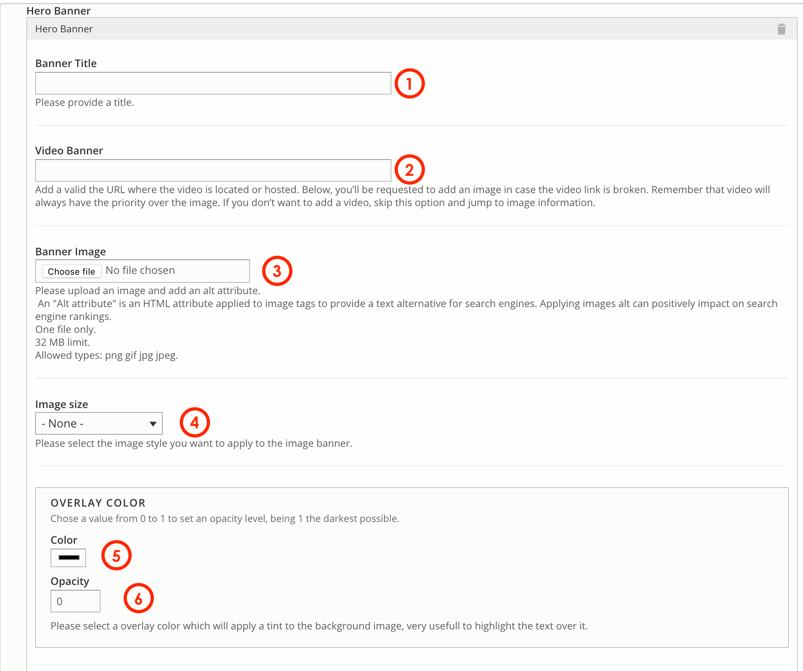
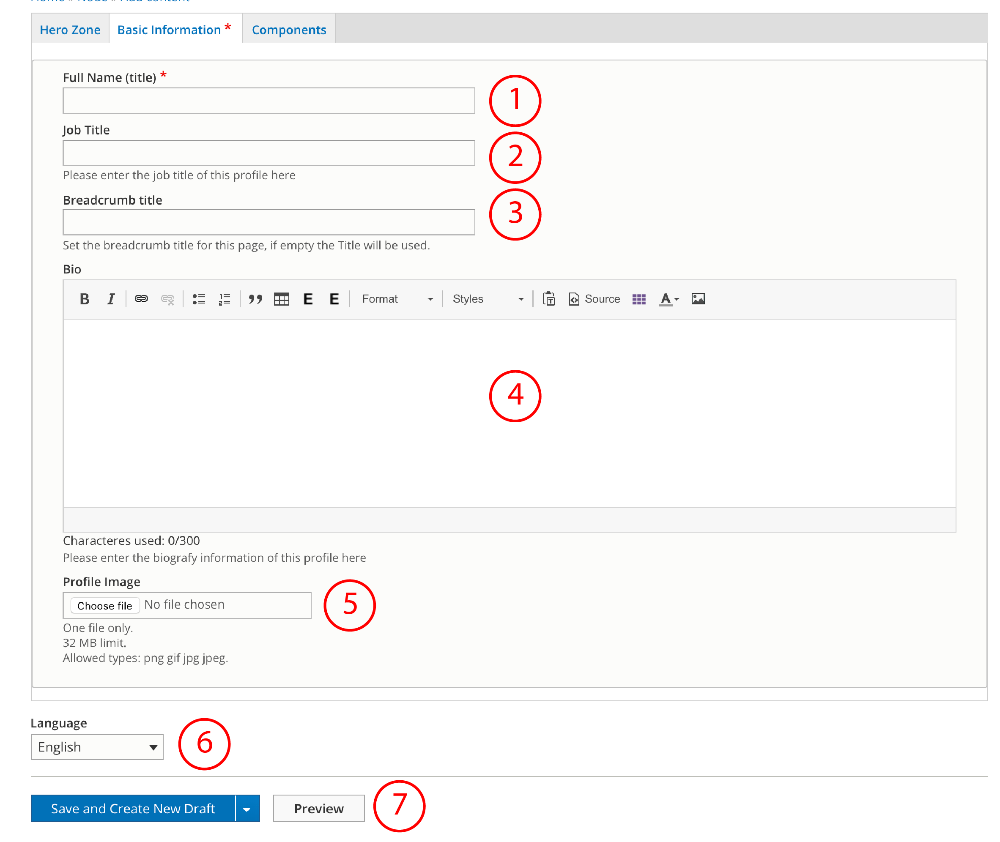
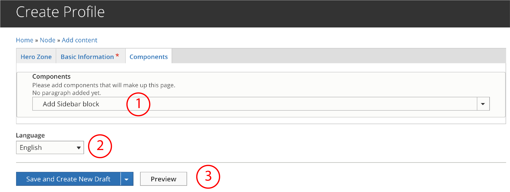

# Profiles content type

**Profiles** is the content type we use to create a profile page featuring an image, full name, job title and a biography. 

Once you've created a **Profile**, you'll get a page for that content which will displayed like the image below. 

Besides this view, **Profiles Content type** is the content that will appear when we use [**Profiles paragraphs**](../paragraphs/profiles.md). Like the image shown below:

## How to create a Profile content type

To create a Generic detail select **Content** =&gt; **Add Content** =&gt; **Profile**

You should see a form composed by 3 tabs: _Hero zone, Basic Information_ and _Components._ 

### First tab: Hero Zone

It gives you the option to add a Hero banner to a Profile. If you don't want to add a Hero, skip this step and go directly to the second tab.

1. **Add a Hero Banner**: click Add and fill up the form.
2. **Language**: select the language. This is important in order to properly display the content according to the region that users have selected while they browse the website.
3. **Save:** you can select _"Save and Create New Draft",_ "_Save and Request Review"_ or _"Save and Publish"._

#### Adding a Hero

1. **Banner title:** add a title if desired. This title will not be visible for users.
2. **Video Banner:** add the url where is video is hosted. If you want to use an image instead, skip this step. 
3. **Banner Image:** choose the image to upload from your PC.
4. **Image size:** this option allow editors to select the image size displayed on the viewport.

  
   5 -6. **Overlay color and opacity**: you'll be requested to set a color that will be placed over the image as a background color for the text for featured block item. Once the color selected, you can adjust the opacity. 0 value would be no opacity and 1 full solid color.

### Second tab: Basic Information

1. **Full name**: here goes the name of the person. This is also the ID of the page. 
2. **Job title**: type in the job title for that profile
3. **Breadcrumb** **title**: you can define your own breadcrumb. If you leave this field empty, title will be taken as breadcrumb.
4. **Bio**: add a biography or description for this profile.
5. **Profile image:** select from PC the image you want to add to this profile.
6. **Language**: select the language. This is important in order to properly display the content according to the region that users have selected while they browse the website.
7. **Save:** you can select _"Save and Create New Draft",_ "_Save and Request Review"_ or _"Save and Publish"._

### Third tab: Components

This option allows you to add more component to that page. It can be an Image Library, maybe a video embedded or a sidebar Block with a menu. You can check this information on the paragraphs documentation.   

1. **Add components**: choose the component or paragraph you would like to add from the dropdown menu
2. **Language**: select the language. This is important in order to properly display the content according to the region that users have selected while they browse the website.
3. **Save:** you can select _"Save and Create New Draft",_ "_Save and Request Review"_ or _"Save and Publish"._

Congratulations, now you're ready to create and publish **profiles!** 

