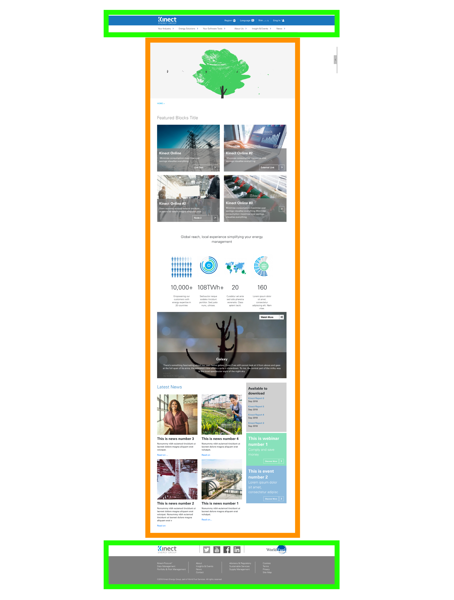

# Creating pages using paragraphs and content types

So far, we have seen the different content types and paragraphs available in Kinect site. Now it's time to learn more about how we can put them together in order to create a page. 

We're going to give you graphic examples using the most common templates found in Kinect site. We'll show you the first steps required to create a page from scratch. 

Remember, this is the structure of the page, it means that we'll show you how to choose and use paragraphs and content types, but you'll also requested to read the entire document to fully understand how to create each one of those paragraphs and content types. 

## **Standard Content Page** 

**Is the content type we use to create a page...**

Take the homepage as an example. Below, you can see the homepage layout. This is a typical Standard content page template. 

Highlighted in **green color,** you can see the components already preloaded in the template: _header, top links, menu, floating menu, footer and bottom footer_. 

In **orange color,** all the paragraphs that we have used to create the page. Once again, remember that most paragraphs are just wraps displaying the content created in different content types. 

## Creating homepage

Is the page where you use the most paragraphs and content types. 

We're going to split the homepage in 2 parts so we can see in detail each one of the components that have been used. 

