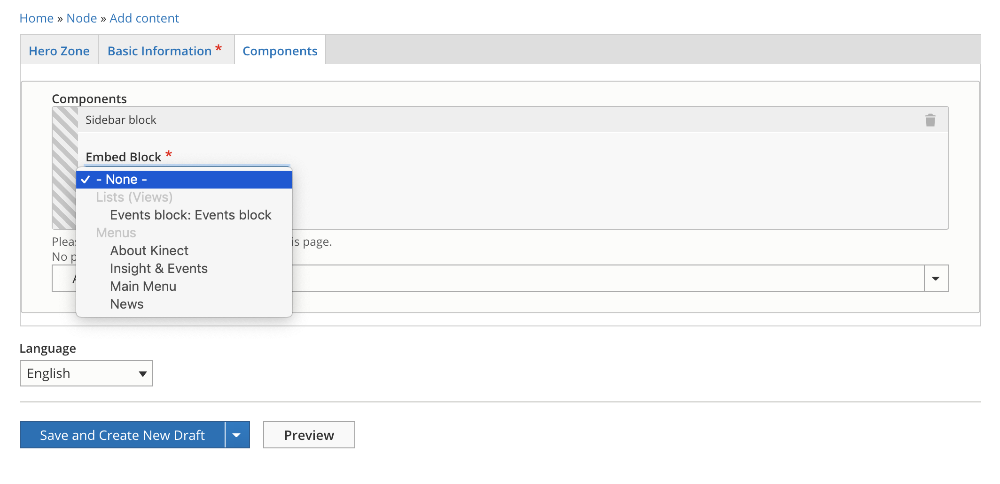

# Sidebar

Is a component that allows us to create a block where we can showcase different pieces of content, such as: menus, upcoming events or downloads. 

This is an example of a Siderbar block using a [View Menu](../views/menus.md)

## **Content Types** 

This paragraph can be used within the following content types:

* Standard content page
* Profiles

Currently you can see this paragraph used within Kinect site homepage here: https://www.kinectenergy.com/en

## **Step-by-step guide** 

To create a Featured Blocks Paragraph, select **Content** =&gt; **Add Content** =&gt; **Standard Content Page** \(or any other content type that includes this paragraph \).

To add this paragraph, go to **Components tabs** and select **Add Siderbar** from the the drop down menu:

### Basic information

1. **Title:** define a title for this component. If you don't want the title to be displayed, check the box "Hide basic information" located at the bottom of this form.
2. **Region:** set the region from the dropdown menu. The hero will be displayed only on the region that you have selected. Select language so the content can be display for the users who have selected the same language. 
3. **Save:** you can select _"Save and Create New Draft",_ "_Save and Request Review"_ or _"Save and Publish"._

### Components

Simply select one of the views available from the dropdown menu. Select language and click save. 

_**Congratulations...you can now create a Siderbar block!**_

